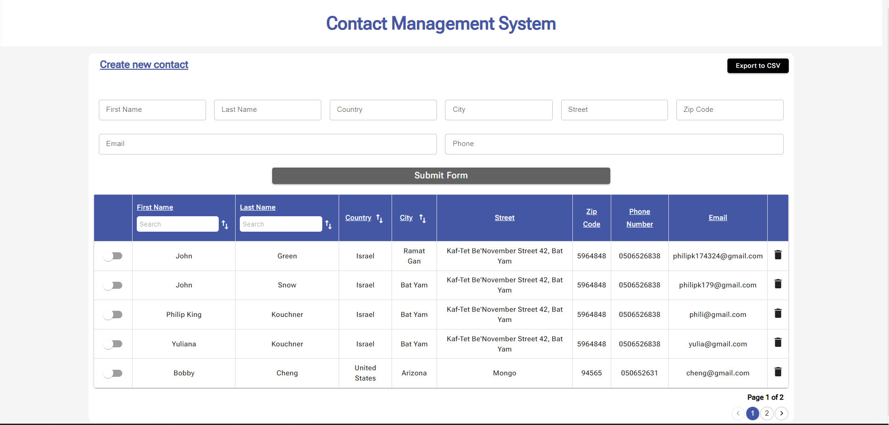

<h1> Contact Management System</h1>

## Introduction: Contact Management System

Welcome to the Contact Management System! This project provides a simple and efficient solution for managing your contacts, offering a RESTful API built with Node.js and Express, as well as a user-friendly React interface.

## Built with

Application was built with the below list backend packages/libraries

- Express - Building a robust and scalable backend
- Sequelize - An ORM for working with MSSQL databases.
- TS - Ensuring type safety and enhancing development experience.

API Features:

CRUD Operations:

- Create, Read, Update, and Delete contacts through well-defined Express routes.
- Postman folder contain JSON file of CRUD operations.

For the Frontend packages/libraries

- React
- Material UI
- style-components
- react-table

Database:

A deployment script is provided (database.sql) containing the SQL query to create the contacts table.

## Getting Started

- Clone the Repo
- Run `npm i` (install server)
- cd to client
- Run `npm i` (install react)
- Create a .env file in the root directory of the app and save your sql server credentials to a a variables:

  DB_DATABASE,DB_USERNAME,DB_PASSWORD,DB_HOST.

  Example:
  `DB_DATABASE=contacts_db
DB_USERNAME=sa
DB_PASSWORD=password
DB_HOST=DESKTOP-VF5556V`

## Development server:

- Run `npm run start` for a dev server.
- Cd to client folder - Run `npm run dev` for a client.
- Open Google Chrome and type - `http://localhost:3000/`.

## Contributors

- Philip Kouchner
